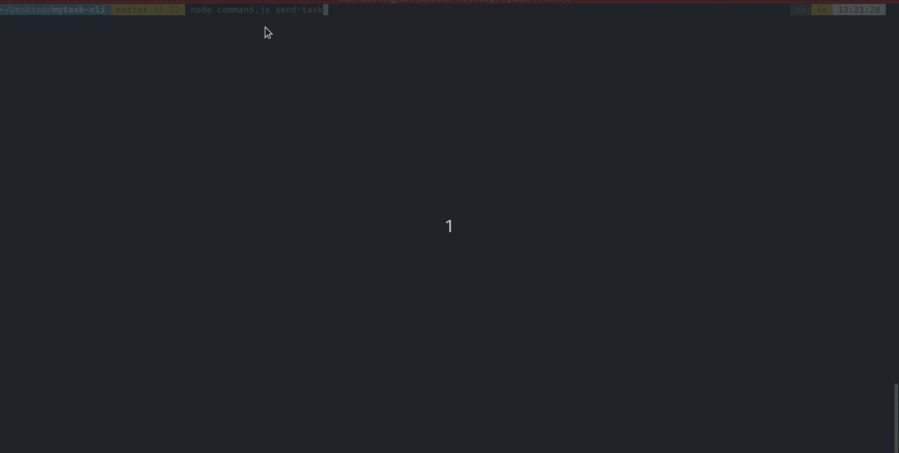

# mytask-CLI 
- add your task using command line interface
- send an email using command line interface

### Walk through 
- Initilize node project `npm init`
- Add required packages `$ yarn add commander inquirer mongoose nodemailer dotenv`
- Add files for which includes all the methods to add your task and send email
  - Tasks/tasks.js and Email/email.js
  - Establish a database connection and functionalities to perform CRUD on your task
  - Setup the nodemailer and a function to send an email
- Create a `command.js` file to include the command to execute using cli
- Add the command `#!/usr/bin/env node` in the begining of the `command.js` file
- Configure the `package.json` file 
```javascript
"preferGlobal": true,
"bin": "./command.js",
```
- Create a simlink using command `npm link`  
and simply unlink using command `npm unlink`
- After you link you can simply call your app using your application name `mytask`

### Commands
|Title|Commands|Alias|Params|Task description|
|--- |--- |--- |--- |--- |
|Add new task|`add-task`|`add`|inquirer will ask task title|add a new task to the db|
|Find task by title|`find-task`|`find`|inquirer will ask the title|list all the task from the db that matches the title|
|Find task by status|`find-by-status `|`f-status`|true or false|list all the task from the db with the status provided|
|Update a task|`update-task`|`update`|<_id> provide the id of the task|update the task info. that matches the task id|
|List all the task|`list-all`|`list`|no params|list all the task from the db|
|Remove the task|`remove-task <_id>`|`remove`|<_id> the task id|remove the task from the db with the provided id|
|Delete all tasks|`delete-all`|`delete`|no params|delete all the tasks|
|Send an Email|`send-email`|`mail`|inquirer will ask email info|send an email to receiver|
|Send list of all my task|`mail-my-task `|`send-task`|receivers email|send the list of all your task to the receiver's email|

### Demo
